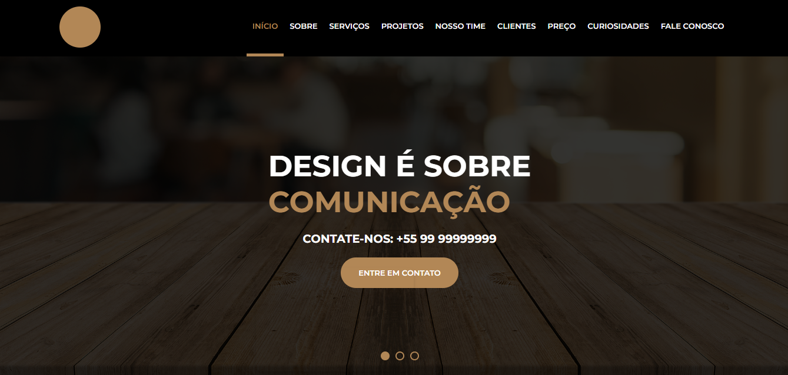

# Everton Store - Portifólio

> Portifólio criado para estudo de Html, Css, Git e responsividade.

<h3 align="center">
Status: Developing ⚠️
</h3>

# 🔗 Links
 
  - Link para visualização: (https://evertonnunesc.github.io/Everton-Store/)
   
    - Em caso de bugs sensíveis, como vulnerabilidades de segurança, entre em contato em
      evertonnunesc@gmail.com diretamente em vez de usar o rastreador de problemas. Valorizamos o seu esforço
      para melhorar a segurança e privacidade deste projeto!

# 🔧 Ajustes e melhorias

O projeto ainda está em desenvolvimento e as próximas atualizações serão voltadas nas seguintes tarefas:

- [x] Projeto inicial
- [x] Organização da estrutura
- [x] Header
- [x] Menu
- [x] Banner
- [x] Slide
- [x] Sections
- [x] Serviços
- [x] Projetos
- [ ] Nosso time
- [ ] Mapa
- [ ] Rodapé
- [ ] Responsividade Tablet
- [ ] Responsividade Mobile

# 💈Padrões de Emojis

<table>
  <thead>
    <tr>
      <th>Tipo de commit</th>
      <th>Emojis</th>
      <th>Palavra-chave</th>
    </tr>
  </thead>
 <tbody>
    <tr>
      <td>Novo recurso</td>
      <td>✨ <code>:sparkles:</code></td>
      <td><code>feat</code></td>
    </tr>
    <tr>
      <td>Atualização</td>
      <td>📦 <code>:package:</code></td>
      <td><code>feat</code></td>
    </tr>
    <tr>
      <td>Correção de Bug</td>
      <td>🐛 <code>:bug:</code></td>
      <td><code>fix</code></td>
    </tr>
    <tr>
      <td>Comentários</td>
      <td>💡 <code>:bulb:</code></td>
      <td><code>docs</code></td>
    </tr>
    <tr>
      <td>Commit inicial</td>
      <td>🎉 <code>:tada:</code></td>
      <td><code>init</code></td>
    </tr>
    <tr>
      <td>Testes</td>
      <td>🔧 <code>:wrench:</code></td>
      <td><code></code></td>
    </tr>
    <tr>
      <td>Documentação</td>
      <td>📚 <code>:books:</code></td>
      <td><code>docs</code></td>
    </tr>
    <tr>
      <td>Estilização de interface</td>
      <td>💄 <code>:lipstick:</code></td>
      <td><code>feat</code></td>
    </tr>
    <tr>
      <td>Lista de ideias (tasks)</td>
      <td>🔜 <code> :soon: </code></td>
      <td></td>
    </tr>
    <tr>
      <td>Mover/Renomear</td>
      <td>🚚 <code>:truck:</code></td>
      <td><code>chore</code></td>
    </tr>
    <tr>
      <td>Removendo um arquivo</td>
      <td>🔥 <code>:fire:</code></td>
      <td></td>
    </tr>
    <tr>
      <td>Responsividade</td>
      <td>📱 <code>:iphone:</code></td>
      <td></td>
    </tr>
    <tr>
    <tr>
      <td>Tratamento de erros</td>
      <td>🥅 <code>:goal_net:</code></td>
      <td></td>
    </tr>
  </tbody>
</table>

Exemplo:

<table>
  <thead>
    <tr>
      <th>Comando git</th>
      <th>Resultado no GitHub</th>
    </tr>
  </thead>
 <tbody>
    <tr>
      <td>
        <code>git commit -m ":lipstick: feat: Estilizaçao CSS do formulario"</code>
      </td>
      <td>💄 feat: Estilizaçao CSS do formulario</td>
    </tr>
</tbody>
</table>

# 💻 Referências

1. Fontes - (https://fonts.google.com/)
2. Cores - #b28756

# 🤝 Seja um dos Contribuidores 

- Quer fazer parte desse projeto? Clique [AQUI](CONTRIBUTING.md) e leia como contribuir.

  - 📝 LICENÇA

    - Esse projeto está sob licença. Veja o arquivo [LICENÇA](LICENSE.md) para mais detalhes.
    - Como alternativa, consulte a documentação do GitHub em [como criar uma solicitação pull](https://help.github.com/en/github/collaborating-with-issues-and-pull-requests/creating-a-pull-request).
    - Projeto aberto para ajuda, lembre de seguir os requisitos da licensa...
  - Se você gostou do que eu criei, talvez possa me pagar aquele Café/Chá que todo brasileiro ama! 🥺👉👈

# 🦄 Colaboradores

Agradecemos às seguintes pessoas que contribuíram para este projeto:

<table>
  <tr>
    <td align="center">
      <a href="#">
         
        
          <b>Everton Nunes</b>
        
      </a>
    </td>
  </tr>
</table>

* **EVERTON NUNES**: @EVERTONNUNES (https://github.com/evertonnunesc)
 
 
Por favor, me siga no github e junte-se a nós! Obrigado por me visitar e boa codificação!

Copyright © 2022 Everton Nunes

[⬆ Voltar ao topo](#Everton-Store) 
